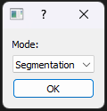
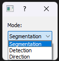
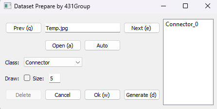
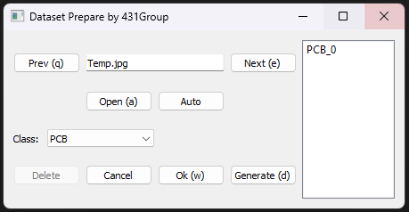
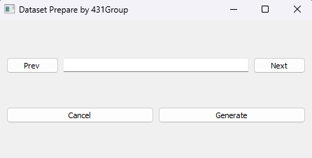

# РУКОВОДСТВО ПОЛЬЗОВАТЕЛЯ
## 1.	Запуск программы
1.	Поместить изображения в формате `.png` или `.jpg` для обработки в директорию `input`.
2.	При необходимости в файле `main.py` настроить размеры изображения и список классов.
3.	Запустить программу `main.py`.
4.	В появившемся окне выбрать режим работы (см. Рисунок 1) и нажать кнопку `«Ok»`. На момент написания инструкции существует 3 режима работы программы: сегментация, детектирование и определение ориентации.

## 2.	Сегментация
1.	Элементы окна сегментации показаны на Рисунке 2.
2.	Кнопки `«Next»` и `«Prev»` отвечают за смену изображения.
3.	Выбрать класс для разметки можно в выпадающем списке `«Class»`.
4.	Нажатие левой кнопки мыши по объекту на открывшемся изображении задает координаты точки, которые передаются в модель SAM2 как точка, принадлежащая объекту. Нажатие же правой кнопкой задает точку, НЕ принадлежащую объекту. После каждого нажатия вызывается модель SAM2 и пересчитываются маски. 
5.	Если требуется полностью ручная разметка или редактирование, есть флаг «Draw», который включает режим кисти. Левая кнопка мыши рисует, правая – стирает. Размер кисти регулируется значением `«Size»`.
6.	Если разметку нужно полностью отменить – кнопка `«Canсel»`.
7.	После завершения разметки одного объекта необходимо нажать кнопку `«Ok»` и маска объекта будет сохранена в программе. В список в правой части при этом добавится название только что сохраненного объекта.
8.	Если сохраненный элемент нужно отредактировать, его нужно выбрать в списке справа, отредактировать маску и снова нажать `«Ok»` (чтобы избежать проблем с багами, я рекомендую просто удалить объект и разметить его заново).  
9.	Если сохраненный элемент нужно удалить, его нужно выбрать в списке справа и нажать на кнопку `«Delete»`.
10.	 После разметки всех интересующих объектов, для генерации файла с лейблом нужно нажать на кнопку «Generate». В директории output появится `.txt` файл с лейблом. Повторные нажатия на кнопку будут перезаписывать файл.
11.	 Если нужно отредактировать уже сохраненный файл, его можно открыть при помощи кнопки `«Open»`. При этом все размеченные и несохраненные объекты будут полностью стерты. Рекомендую делать такую проверку после каждой завершенной обработки изображения.
12.	 При переключении на следующее или предыдущие изображение, все несохраненные маски будут полностью стерты.

## 3.	Детектирование
1.	Элементы окна детектирования показаны на Рисунке 3.
2.	Кнопки `«Next»` и `«Prev»` отвечают за смену изображения.
3.	Выбрать класс для разметки можно в выпадающем списке `«Class»`.
4.	Нажатие левой кнопки мыши начинает отрисовку прямоугольника, повторное нажатие заканчивает, после чего прямоугольник появляется на изображении. 
5.	Если разметку нужно полностью отменить – кнопка `«Canсel»`.
6.	После завершения разметки одного объекта необходимо нажать кнопку `«Ok»` и bounding box объекта будет сохранен в программе. В список в правой части при этом добавится название только что сохраненного объекта.
7.	Если сохраненный элемент нужно отредактировать, его нужно выбрать в списке справа, отредактировать bounding box и снова нажать `«Ok»` (чтобы избежать проблем с багами, я рекомендую просто удалить объект и разметить его заново).  
8.	Если сохраненный элемент нужно удалить, его нужно выбрать в списке справа и нажать на кнопку `«Delete»`.
9.	После разметки всех интересующих объектов, для генерации файла с лейблом нужно нажать на кнопку `«Generate»`. В директории output появится `.txt` файл с лейблом. Повторные нажатия на кнопку будут перезаписывать файл.
10.	 Если нужно отредактировать уже сохраненный файл, его можно открыть при помощи кнопки «Open». При этом все размеченные и несохраненные объекты будут полностью стерты. Рекомендую делать такую проверку после каждой завершенной обработки изображения.
11.	 При переключении на следующее или предыдущие изображение, все несохраненные маски будут полностью стерты.

## 4.	Направление
1.	Элементы окна определения показаны на Рисунке 4.
2.	Кнопки `«Next»` и `«Prev»` отвечают за смену изображения.
3.	Нажатие левой кнопки мыши отмечает начало вектора направления, повторное нажатие отмечает направление вектора, после чего вектор появляется на изображении. 
4.	Если разметку нужно полностью отменить – кнопка `«Canсel»`.
5.	После разметки всех интересующих объектов, для генерации файла с лейблом нужно нажать на кнопку `«Generate»`. В директории output появится `.txt` файл с лейблом. Повторные нажатия на кнопку будут перезаписывать файл. Лейбл – координаты начала вектора, отнормированные на размер изображения, и длина проекций отнормированной длины.  
6.	При переключении на следующее или предыдущие изображение, все несохраненные маски будут полностью стерты.

## 5. Решение проблем
1.	Если программа зависает при открытии изображения (обычно это происходит при разметке 120-150 изображений), программу нужно перезапустить. Чтобы избегать такой проблемы разметку лучше проводить «батчами» по 100 изображений.
